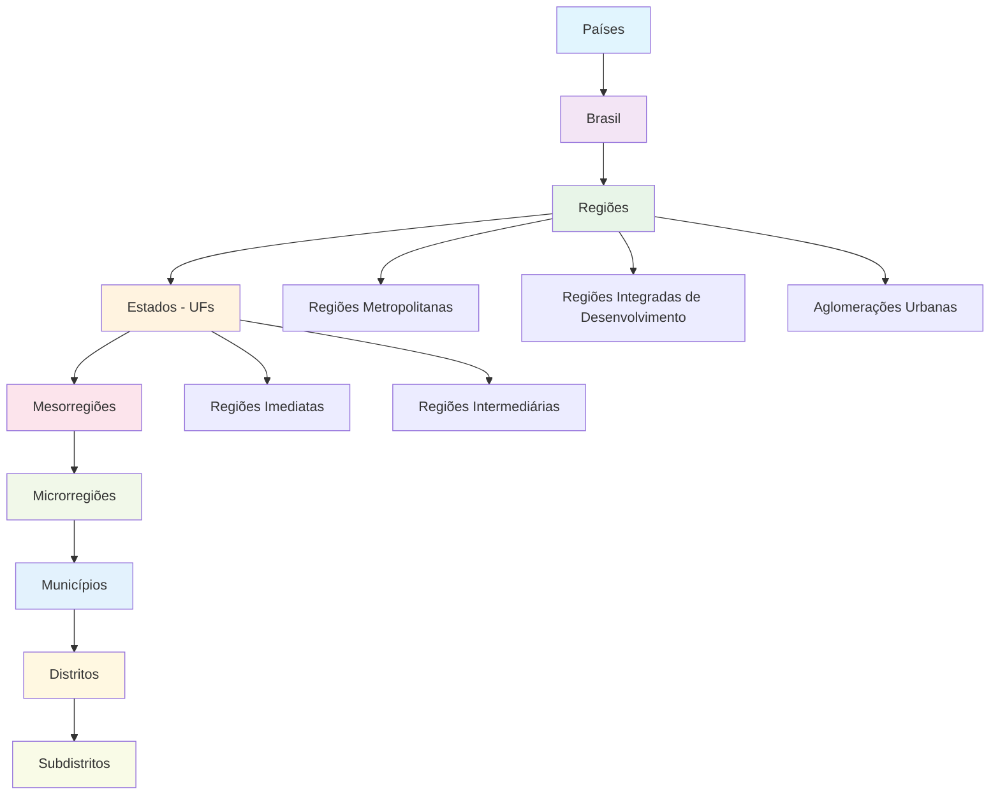

# 📍 Arquitetura Hierárquica do Sistema de Localizações

> Sistema completo de localizações geográficas do Brasil integrado com a API do IBGE.

## 🔙 [Voltar para Documentação Principal](README.md)

---

## 🎯 Visão Geral

Este documento descreve a arquitetura do sistema de localizações que **consome da API oficial do IBGE para alimentar nosso banco SQL local**, implementando uma estrutura hierárquica que vai desde países até subdistritos. O sistema consome dados da API IBGE e os armazena localmente para consultas rápidas e offline, seguindo a metodologia M49 da ONU e as divisões político-administrativas do Brasil.

**Ver também**: [Estrutura do Banco de Dados - Seção 4: Localização Geográfica](database-structure.md#4-localização-geográfica)

### 🔄 **Estratégia de Integração: API-to-Database**
- ✅ **Consumo da API**: Importar dados da API IBGE
- ✅ **Armazenamento Local**: Dados no banco SQL para performance
- ✅ **Sincronização**: Atualização periódica dos dados
- ✅ **Cache Local**: Consultas rápidas sem dependência da API

## 🏗️ Estrutura Hierárquica Completa

### 📊 Diagrama da Hierarquia



## 🗄️ Estrutura das Tabelas SQL

### 📋 **Abordagem: API-to-Database Architecture**

O sistema consome dados da API do IBGE e os armazena localmente no banco SQL com as seguintes características:

### 1. **Países (countries)**
```sql
CREATE TABLE countries (
    id INT PRIMARY KEY AUTO_INCREMENT,
    ibge_id INT UNIQUE NOT NULL,           -- ID oficial do IBGE
    name VARCHAR(255) NOT NULL,            -- Nome do país
    name_en VARCHAR(255),                  -- Nome em inglês
    iso_alpha2 CHAR(2),                    -- Código ISO 3166-1 alpha-2
    iso_alpha3 CHAR(3),                    -- Código ISO 3166-1 alpha-3
    region_code VARCHAR(10),               -- Código da região (M49)
    sub_region_code VARCHAR(10),           -- Código da sub-região (M49)
    intermediate_region_code VARCHAR(10),  -- Código da região intermediária (M49)
    created_at TIMESTAMP DEFAULT CURRENT_TIMESTAMP,
    updated_at TIMESTAMP DEFAULT CURRENT_TIMESTAMP ON UPDATE CURRENT_TIMESTAMP
);
```

### 2. **Regiões (regions)**
```sql
CREATE TABLE regions (
    id INT PRIMARY KEY AUTO_INCREMENT,
    ibge_id INT UNIQUE NOT NULL,           -- ID oficial do IBGE
    name VARCHAR(255) NOT NULL,            -- Nome da região
    abbreviation VARCHAR(10) NOT NULL,     -- Sigla (N, NE, SE, S, CO)
    country_id INT NOT NULL,               -- FK para countries
    created_at TIMESTAMP DEFAULT CURRENT_TIMESTAMP,
    updated_at TIMESTAMP DEFAULT CURRENT_TIMESTAMP ON UPDATE CURRENT_TIMESTAMP,
    FOREIGN KEY (country_id) REFERENCES countries(id)
);
```

### 3. **Estados - UFs (states)**
```sql
CREATE TABLE states (
    id INT PRIMARY KEY AUTO_INCREMENT,
    ibge_id INT UNIQUE NOT NULL,           -- ID oficial do IBGE
    name VARCHAR(255) NOT NULL,            -- Nome do estado
    abbreviation VARCHAR(2) NOT NULL,      -- Sigla (SP, RJ, MG, etc.)
    region_id INT NOT NULL,                -- FK para regions
    country_id INT NOT NULL,               -- FK para countries
    created_at TIMESTAMP DEFAULT CURRENT_TIMESTAMP,
    updated_at TIMESTAMP DEFAULT CURRENT_TIMESTAMP ON UPDATE CURRENT_TIMESTAMP,
    FOREIGN KEY (region_id) REFERENCES regions(id),
    FOREIGN KEY (country_id) REFERENCES countries(id)
);
```

### 4. **Mesorregiões (mesoregions)**
```sql
CREATE TABLE mesoregions (
    id INT PRIMARY KEY AUTO_INCREMENT,
    ibge_id INT UNIQUE NOT NULL,           -- ID oficial do IBGE
    name VARCHAR(255) NOT NULL,            -- Nome da mesorregião
    state_id INT NOT NULL,                 -- FK para states
    region_id INT NOT NULL,                -- FK para regions
    country_id INT NOT NULL,               -- FK para countries
    created_at TIMESTAMP DEFAULT CURRENT_TIMESTAMP,
    updated_at TIMESTAMP DEFAULT CURRENT_TIMESTAMP ON UPDATE CURRENT_TIMESTAMP,
    FOREIGN KEY (state_id) REFERENCES states(id),
    FOREIGN KEY (region_id) REFERENCES regions(id),
    FOREIGN KEY (country_id) REFERENCES countries(id)
);
```

### 5. **Microrregiões (microregions)**
```sql
CREATE TABLE microregions (
    id INT PRIMARY KEY AUTO_INCREMENT,
    ibge_id INT UNIQUE NOT NULL,           -- ID oficial do IBGE
    name VARCHAR(255) NOT NULL,            -- Nome da microrregião
    mesoregion_id INT NOT NULL,            -- FK para mesoregions
    state_id INT NOT NULL,                 -- FK para states
    region_id INT NOT NULL,                -- FK para regions
    country_id INT NOT NULL,               -- FK para countries
    created_at TIMESTAMP DEFAULT CURRENT_TIMESTAMP,
    updated_at TIMESTAMP DEFAULT CURRENT_TIMESTAMP ON UPDATE CURRENT_TIMESTAMP,
    FOREIGN KEY (mesoregion_id) REFERENCES mesoregions(id),
    FOREIGN KEY (state_id) REFERENCES states(id),
    FOREIGN KEY (region_id) REFERENCES regions(id),
    FOREIGN KEY (country_id) REFERENCES countries(id)
);
```

### 6. **Municípios (cities)**
```sql
CREATE TABLE cities (
    id INT PRIMARY KEY AUTO_INCREMENT,
    ibge_id INT UNIQUE NOT NULL,           -- ID oficial do IBGE
    name VARCHAR(255) NOT NULL,            -- Nome do município
    microregion_id INT NOT NULL,           -- FK para microregions
    mesoregion_id INT NOT NULL,            -- FK para mesoregions
    state_id INT NOT NULL,                 -- FK para states
    region_id INT NOT NULL,                -- FK para regions
    country_id INT NOT NULL,               -- FK para countries
    created_at TIMESTAMP DEFAULT CURRENT_TIMESTAMP,
    updated_at TIMESTAMP DEFAULT CURRENT_TIMESTAMP ON UPDATE CURRENT_TIMESTAMP,
    FOREIGN KEY (microregion_id) REFERENCES microregions(id),
    FOREIGN KEY (mesoregion_id) REFERENCES mesoregions(id),
    FOREIGN KEY (state_id) REFERENCES states(id),
    FOREIGN KEY (region_id) REFERENCES regions(id),
    FOREIGN KEY (country_id) REFERENCES countries(id)
);
```

### 7. **Distritos (districts)**
```sql
CREATE TABLE districts (
    id INT PRIMARY KEY AUTO_INCREMENT,
    ibge_id INT UNIQUE NOT NULL,           -- ID oficial do IBGE
    name VARCHAR(255) NOT NULL,            -- Nome do distrito
    city_id INT NOT NULL,                  -- FK para cities
    microregion_id INT NOT NULL,           -- FK para microregions
    mesoregion_id INT NOT NULL,            -- FK para mesoregions
    state_id INT NOT NULL,                 -- FK para states
    region_id INT NOT NULL,                -- FK para regions
    country_id INT NOT NULL,               -- FK para countries
    created_at TIMESTAMP DEFAULT CURRENT_TIMESTAMP,
    updated_at TIMESTAMP DEFAULT CURRENT_TIMESTAMP ON UPDATE CURRENT_TIMESTAMP,
    FOREIGN KEY (city_id) REFERENCES cities(id),
    FOREIGN KEY (microregion_id) REFERENCES microregions(id),
    FOREIGN KEY (mesoregion_id) REFERENCES mesoregions(id),
    FOREIGN KEY (state_id) REFERENCES states(id),
    FOREIGN KEY (region_id) REFERENCES regions(id),
    FOREIGN KEY (country_id) REFERENCES countries(id)
);
```

### 8. **Subdistritos (subdistricts)**
```sql
CREATE TABLE subdistricts (
    id INT PRIMARY KEY AUTO_INCREMENT,
    ibge_id INT UNIQUE NOT NULL,           -- ID oficial do IBGE
    name VARCHAR(255) NOT NULL,            -- Nome do subdistrito
    district_id INT NOT NULL,              -- FK para districts
    city_id INT NOT NULL,                  -- FK para cities
    microregion_id INT NOT NULL,           -- FK para microregions
    mesoregion_id INT NOT NULL,            -- FK para mesoregions
    state_id INT NOT NULL,                 -- FK para states
    region_id INT NOT NULL,                -- FK para regions
    country_id INT NOT NULL,               -- FK para countries
    created_at TIMESTAMP DEFAULT CURRENT_TIMESTAMP,
    updated_at TIMESTAMP DEFAULT CURRENT_TIMESTAMP ON UPDATE CURRENT_TIMESTAMP,
    FOREIGN KEY (district_id) REFERENCES districts(id),
    FOREIGN KEY (city_id) REFERENCES cities(id),
    FOREIGN KEY (microregion_id) REFERENCES microregions(id),
    FOREIGN KEY (mesoregion_id) REFERENCES mesoregions(id),
    FOREIGN KEY (state_id) REFERENCES states(id),
    FOREIGN KEY (region_id) REFERENCES regions(id),
    FOREIGN KEY (country_id) REFERENCES countries(id)
);
```

## 🔗 Tabelas de Regiões Especiais

### 9. **Regiões Imediatas (immediate_regions)**
```sql
CREATE TABLE immediate_regions (
    id INT PRIMARY KEY AUTO_INCREMENT,
    ibge_id INT UNIQUE NOT NULL,           -- ID oficial do IBGE
    name VARCHAR(255) NOT NULL,            -- Nome da região imediata
    intermediate_region_id INT,            -- FK para intermediate_regions
    state_id INT NOT NULL,                 -- FK para states
    region_id INT NOT NULL,                -- FK para regions
    country_id INT NOT NULL,               -- FK para countries
    created_at TIMESTAMP DEFAULT CURRENT_TIMESTAMP,
    updated_at TIMESTAMP DEFAULT CURRENT_TIMESTAMP ON UPDATE CURRENT_TIMESTAMP,
    FOREIGN KEY (intermediate_region_id) REFERENCES intermediate_regions(id),
    FOREIGN KEY (state_id) REFERENCES states(id),
    FOREIGN KEY (region_id) REFERENCES regions(id),
    FOREIGN KEY (country_id) REFERENCES countries(id)
);
```

### 10. **Regiões Intermediárias (intermediate_regions)**
```sql
CREATE TABLE intermediate_regions (
    id INT PRIMARY KEY AUTO_INCREMENT,
    ibge_id INT UNIQUE NOT NULL,           -- ID oficial do IBGE
    name VARCHAR(255) NOT NULL,            -- Nome da região intermediária
    state_id INT NOT NULL,                 -- FK para states
    region_id INT NOT NULL,                -- FK para regions
    country_id INT NOT NULL,               -- FK para countries
    created_at TIMESTAMP DEFAULT CURRENT_TIMESTAMP,
    updated_at TIMESTAMP DEFAULT CURRENT_TIMESTAMP ON UPDATE CURRENT_TIMESTAMP,
    FOREIGN KEY (state_id) REFERENCES states(id),
    FOREIGN KEY (region_id) REFERENCES regions(id),
    FOREIGN KEY (country_id) REFERENCES countries(id)
);
```

### 11. **Regiões Metropolitanas (metropolitan_regions)**
```sql
CREATE TABLE metropolitan_regions (
    id INT PRIMARY KEY AUTO_INCREMENT,
    ibge_id INT UNIQUE NOT NULL,           -- ID oficial do IBGE
    name VARCHAR(255) NOT NULL,            -- Nome da região metropolitana
    state_id INT NOT NULL,                 -- FK para states
    region_id INT NOT NULL,                -- FK para regions
    country_id INT NOT NULL,               -- FK para countries
    created_at TIMESTAMP DEFAULT CURRENT_TIMESTAMP,
    updated_at TIMESTAMP DEFAULT CURRENT_TIMESTAMP ON UPDATE CURRENT_TIMESTAMP,
    FOREIGN KEY (state_id) REFERENCES states(id),
    FOREIGN KEY (region_id) REFERENCES regions(id),
    FOREIGN KEY (country_id) REFERENCES countries(id)
);
```

### 12. **Aglomerações Urbanas (urban_agglomerations)**
```sql
CREATE TABLE urban_agglomerations (
    id INT PRIMARY KEY AUTO_INCREMENT,
    ibge_id INT UNIQUE NOT NULL,           -- ID oficial do IBGE
    name VARCHAR(255) NOT NULL,            -- Nome da aglomeração urbana
    state_id INT NOT NULL,                 -- FK para states
    region_id INT NOT NULL,                -- FK para regions
    country_id INT NOT NULL,               -- FK para countries
    created_at TIMESTAMP DEFAULT CURRENT_TIMESTAMP,
    updated_at TIMESTAMP DEFAULT CURRENT_TIMESTAMP ON UPDATE CURRENT_TIMESTAMP,
    FOREIGN KEY (state_id) REFERENCES states(id),
    FOREIGN KEY (region_id) REFERENCES regions(id),
    FOREIGN KEY (country_id) REFERENCES countries(id)
);
```

### 13. **Regiões Integradas de Desenvolvimento (integrated_development_regions)**
```sql
CREATE TABLE integrated_development_regions (
    id INT PRIMARY KEY AUTO_INCREMENT,
    ibge_id INT UNIQUE NOT NULL,           -- ID oficial do IBGE
    name VARCHAR(255) NOT NULL,            -- Nome da região integrada
    state_id INT NOT NULL,                 -- FK para states
    region_id INT NOT NULL,                -- FK para regions
    country_id INT NOT NULL,               -- FK para countries
    created_at TIMESTAMP DEFAULT CURRENT_TIMESTAMP,
    updated_at TIMESTAMP DEFAULT CURRENT_TIMESTAMP ON UPDATE CURRENT_TIMESTAMP,
    FOREIGN KEY (state_id) REFERENCES states(id),
    FOREIGN KEY (region_id) REFERENCES regions(id),
    FOREIGN KEY (country_id) REFERENCES countries(id)
);
```

### 📊 **Interfaces TypeScript para Consumo da API**

```typescript
// Interface base para todas as entidades IBGE
interface IbgeEntity {
  id: number;
  nome: string;
}

// Países
interface IbgeCountry extends IbgeEntity {
  iso_alpha2: string;
  iso_alpha3: string;
  regiao: {
    id: number;
    nome: string;
  };
  sub_regiao: {
    id: number;
    nome: string;
  };
  regiao_intermediaria: {
    id: number;
    nome: string;
  };
}

// Regiões Brasileiras
interface IbgeRegion extends IbgeEntity {
  sigla: string;  // N, NE, SE, S, CO
}

// Estados
interface IbgeState extends IbgeEntity {
  sigla: string;  // SP, RJ, MG, etc.
  regiao: IbgeRegion;
}

// Mesorregiões
interface IbgeMesoregion extends IbgeEntity {
  UF: IbgeState;
}

// Microrregiões
interface IbgeMicroregion extends IbgeEntity {
  mesorregiao: IbgeMesoregion;
}

// Municípios
interface IbgeCity extends IbgeEntity {
  microrregiao: IbgeMicroregion;
}

// Distritos
interface IbgeDistrict extends IbgeEntity {
  municipio: IbgeCity;
}

// Subdistritos
interface IbgeSubdistrict extends IbgeEntity {
  distrito: IbgeDistrict;
}

// Regiões Imediatas
interface IbgeImmediateRegion extends IbgeEntity {
  UF: IbgeState;
  regiao_intermediaria?: IbgeIntermediateRegion;
}

// Regiões Intermediárias
interface IbgeIntermediateRegion extends IbgeEntity {
  UF: IbgeState;
}

// Regiões Metropolitanas
interface IbgeMetropolitanRegion extends IbgeEntity {
  UF: IbgeState;
}

// Aglomerações Urbanas
interface IbgeUrbanAgglomeration extends IbgeEntity {
  UF: IbgeState;
}

// Regiões Integradas de Desenvolvimento
interface IbgeIntegratedDevelopmentRegion extends IbgeEntity {
  UF: IbgeState;
}
```

## 🔄 Relacionamentos e Constraints

### **Relacionamentos Principais**
- **One-to-Many**: País → Regiões → Estados → Mesorregiões → Microrregiões → Municípios → Distritos → Subdistritos
- **Many-to-One**: Cada entidade filha referencia sua entidade pai
- **Cross-References**: Todas as entidades mantêm referência ao país e região para consultas rápidas

### **Constraints de Integridade**
- **UNIQUE**: `ibge_id` em todas as tabelas (garante unicidade dos códigos IBGE)
- **NOT NULL**: Campos obrigatórios para manter integridade hierárquica
- **FOREIGN KEYS**: Relacionamentos com CASCADE para manutenção de integridade

### **Índices Recomendados**
```sql
-- Índices para performance
CREATE INDEX idx_countries_ibge_id ON countries(ibge_id);
CREATE INDEX idx_regions_ibge_id ON regions(ibge_id);
CREATE INDEX idx_states_ibge_id ON states(ibge_id);
CREATE INDEX idx_states_abbreviation ON states(abbreviation);
CREATE INDEX idx_cities_ibge_id ON cities(ibge_id);
CREATE INDEX idx_cities_name ON cities(name);
CREATE INDEX idx_districts_ibge_id ON districts(ibge_id);
CREATE INDEX idx_subdistricts_ibge_id ON subdistricts(ibge_id);

-- Índices compostos para consultas hierárquicas
CREATE INDEX idx_states_region_country ON states(region_id, country_id);
CREATE INDEX idx_cities_state_region ON cities(state_id, region_id);
CREATE INDEX idx_districts_city_state ON districts(city_id, state_id);
```

## 🔄 Estratégia de Importação da API

### **Arquitetura de Serviços**
```typescript
// Estrutura do módulo de localizações
@Injectable()
export class IbgeService {
  private readonly baseUrl = 'https://servicodados.ibge.gov.br/api/v1/localidades';

  // Métodos para importação de dados da API
  async importCountries(): Promise<void>
  async importRegions(): Promise<void>
  async importStates(): Promise<void>
  async importMesoregions(): Promise<void>
  async importMicroregions(): Promise<void>
  async importCities(): Promise<void>
  async importDistricts(): Promise<void>
  async importSubdistricts(): Promise<void>
  
  // Métodos para regiões especiais
  async importImmediateRegions(): Promise<void>
  async importIntermediateRegions(): Promise<void>
  async importMetropolitanRegions(): Promise<void>
  async importUrbanAgglomerations(): Promise<void>
  async importIntegratedDevelopmentRegions(): Promise<void>
  
  // Método para importação completa
  async importAllData(): Promise<void>
}

@Injectable()
export class LocationsService {
  // Métodos para consulta local
  async getCountries(): Promise<Country[]>
  async getStates(): Promise<State[]>
  async getCitiesByState(stateId: number): Promise<City[]>
  async getDistrictsByCity(cityId: number): Promise<District[]>
  async getSubdistrictsByDistrict(districtId: number): Promise<Subdistrict[]>
}
```

### **Estratégia de Sincronização**
- ✅ **Importação Inicial**: Importar todos os dados da API IBGE
- ✅ **Sincronização Incremental**: Verificar atualizações periódicas
- ✅ **Validação**: Manter integridade referencial durante importação
- ✅ **Transações**: Importação em lotes com rollback em caso de erro

### **Tratamento de Erros**
```typescript
interface IbgeApiError {
  status: number;
  message: string;
  timestamp: Date;
}

// Estratégias de importação
- Retry automático com backoff exponencial
- Importação em lotes para performance
- Logs estruturados para monitoramento
- Rollback em caso de falha na importação
```

## 📊 Estrutura de Dados IBGE

### **Códigos de Identificação**
- **Países**: Códigos M49 da ONU
- **Regiões**: Códigos IBGE (1-5)
- **Estados**: Códigos IBGE (11-53)
- **Mesorregiões**: Códigos IBGE (1101-5305)
- **Microrregiões**: Códigos IBGE (11001-53005)
- **Municípios**: Códigos IBGE (1100015-5300108)
- **Distritos**: Códigos IBGE (110001505-530010805)
- **Subdistritos**: Códigos IBGE (110001505001-530010805001)

### **Exemplo de Hierarquia Completa**
```
Brasil (76)
└── Região Sudeste (3)
    └── São Paulo (35)
        └── Mesorregião Metropolitana de São Paulo (3515)
            └── Microrregião de São Paulo (3550308)
                └── São Paulo (3550308)
                    └── Distrito de Sé (355030805)
                        └── Subdistrito de Sé (355030805001)
```

## 🚀 Endpoints da API IBGE

### **Endpoints Principais Utilizados**
```typescript
// Países
GET /paises                           // Lista todos os países
GET /paises/{id}                      // País específico

// Regiões Brasileiras
GET /regioes                          // Lista todas as regiões (N, NE, SE, S, CO)
GET /regioes/{id}                     // Região específica
GET /regioes/{id}/estados             // Estados por região

// Estados
GET /estados                          // Lista todos os estados
GET /estados/{UF}                     // Estado específico
GET /estados/{UF}/municipios          // Municípios por estado
GET /estados/{UF}/mesorregioes        // Mesorregiões por estado
GET /estados/{UF}/microrregioes       // Microrregiões por estado

// Mesorregiões
GET /mesorregioes                     // Lista todas as mesorregiões
GET /mesorregioes/{id}                // Mesorregião específica
GET /mesorregioes/{id}/microrregioes  // Microrregiões por mesorregião
GET /mesorregioes/{id}/municipios     // Municípios por mesorregião

// Microrregiões
GET /microrregioes                    // Lista todas as microrregiões
GET /microrregioes/{id}               // Microrregião específica
GET /microrregioes/{id}/municipios    // Municípios por microrregião

// Municípios
GET /municipios                       // Lista todos os municípios
GET /municipios/{id}                  // Município específico
GET /municipios/{id}/distritos        // Distritos por município

// Distritos
GET /distritos                        // Lista todos os distritos
GET /distritos/{id}                   // Distrito específico
GET /distritos/{id}/subdistritos      // Subdistritos por distrito

// Subdistritos
GET /subdistritos                     // Lista todos os subdistritos
GET /subdistritos/{id}                // Subdistrito específico

// Regiões Especiais
GET /regioes-imediatas                // Regiões imediatas
GET /regioes-intermediarias           // Regiões intermediárias
GET /regioes-metropolitanas           // Regiões metropolitanas
GET /aglomeracoes-urbanas             // Aglomerações urbanas
GET /regioes-integracao-desenvolvimento // Regiões integradas de desenvolvimento
```

### **Parâmetros de Consulta Disponíveis**
- **`orderBy`**: Ordenação dos resultados (nome, id)
- **`view`**: Formato de visualização (padrão, resumida)
- **Filtros específicos**: Por região, estado, município, etc.

## 📈 Benefícios da Arquitetura API-to-Database

### **Vantagens**
- ✅ **Dados Oficiais**: Informações sempre atualizadas do IBGE
- ✅ **Performance Local**: Consultas rápidas no banco local
- ✅ **Disponibilidade**: Funciona mesmo com API IBGE indisponível
- ✅ **Flexibilidade**: Suporte a diferentes níveis de granularidade
- ✅ **Padronização**: Códigos oficiais para todas as localizações
- ✅ **Escalabilidade**: Índices otimizados para consultas hierárquicas
- ✅ **Confiabilidade**: Dados oficiais e validados pelo IBGE

### **Casos de Uso**
- 🎯 **Validação de Endereços**: Verificar se localização existe no banco local
- 🎯 **Filtros Geográficos**: Buscar por região, estado, município
- 🎯 **Relatórios Regionais**: Agregações por diferentes níveis
- 🎯 **Integração com Veículos**: Rastreamento de localização
- 🎯 **Análises Demográficas**: Dados por divisão administrativa
- 🎯 **Formulários Dinâmicos**: Carregar estados/municípios do banco local

### **Estrutura do Módulo**
```
src/modules/locations/
├── locations.module.ts              // Configuração do módulo
├── locations.controller.ts          // Endpoints REST
├── locations.service.ts             // Lógica de negócio local
├── ibge.service.ts                  // Importação da API IBGE
├── entities/                        // Entidades TypeORM
│   ├── country.entity.ts
│   ├── region.entity.ts
│   ├── state.entity.ts
│   ├── mesoregion.entity.ts
│   ├── microregion.entity.ts
│   ├── city.entity.ts
│   ├── district.entity.ts
│   └── subdistrict.entity.ts
├── dto/                             // Data Transfer Objects
│   ├── location-query.dto.ts
│   └── location-response.dto.ts
├── interfaces/                      // Interfaces TypeScript
│   ├── ibge-country.interface.ts
│   ├── ibge-state.interface.ts
│   └── ibge-city.interface.ts
├── scripts/                         // Scripts de importação
│   ├── import-locations.ts
│   └── sync-locations.ts
└── docs/                            // Documentação
    ├── README.md
    └── api-reference.md
```

## 🔧 Próximos Passos

1. **Implementação das Entidades**: Criar entidades TypeORM
2. **Migrations**: Gerar migrations para todas as tabelas
3. **IbgeService**: Criar service para importação da API
4. **LocationsService**: Implementar consultas locais
5. **LocationsController**: Criar endpoints para consultas
6. **Scripts de Importação**: Implementar scripts CLI
7. **DTOs e Validações**: Implementar validações de entrada
8. **Documentação**: API Reference e exemplos de uso
9. **Testes**: Testes unitários e de integração

---

**Última atualização**: 16/01/2025  
**Versão**: 1.0.0  
**Status**: Documentação completa - Arquitetura API-to-Database definida - Pronto para implementação
