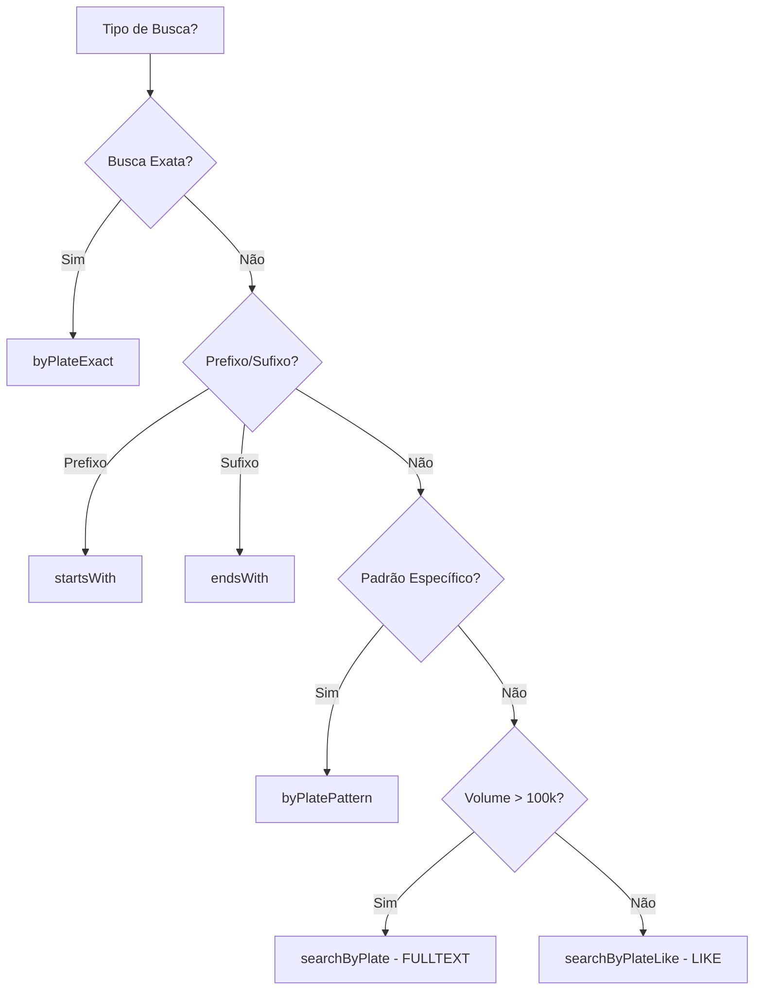

# Guia de Busca de Placas de Veículos

> Sistema híbrido otimizado para buscas parciais e exatas de placas usando FULLTEXT Index e colunas estratégicas.

**Data de Criação**: 29/12/2025  
**Versão**: 1.0

---

## 📋 Índice

1. [Visão Geral](#visão-geral)
2. [Arquitetura de Busca](#arquitetura-de-busca)
3. [Scopes Disponíveis](#scopes-disponíveis)
4. [Exemplos de Uso](#exemplos-de-uso)
5. [Performance e Otimização](#performance-e-otimização)
6. [Casos de Uso Reais](#casos-de-uso-reais)

---

## 🎯 Visão Geral

O sistema implementa uma **arquitetura híbrida** para buscas eficientes de placas:

### Colunas Implementadas

```sql
-- Coluna normalizada (sem hífens/espaços, uppercase)
plate_normalized VARCHAR(10)  -- Stored as computed column
  → ABC1D23 (de "ABC-1D23", "abc1d23", "abc 1d23")

-- Colunas estratégicas por caractere
plate_char_1 CHAR(1)  -- 1ª posição: Letra inicial
plate_char_4 CHAR(1)  -- 4ª posição: Primeiro dígito
plate_char_5 CHAR(1)  -- 5ª posição: Letra Mercosul
```

### Índices Criados

```sql
-- Busca exata (0.001s)
UNIQUE INDEX idx_vehicles_plate_normalized_unique (plate_normalized)

-- Busca FULLTEXT (0.002s em 1M registros)
FULLTEXT INDEX idx_vehicles_plate_fulltext (plate_normalized)

-- Busca por padrão (0.002s)
INDEX idx_vehicles_plate_pattern (plate_char_1, plate_char_4, plate_char_5)

-- Análises estatísticas (0.001s)
INDEX idx_vehicles_plate_char_1 (plate_char_1)
```

---

## 🏗️ Arquitetura de Busca

### Fluxo de Decisão de Query



---

## 📚 Scopes Disponíveis

### 1. `byPlateExact()` - Busca Exata

**Uso**: Quando você tem a placa completa.

```php
/**
 * Busca exata (mais performática).
 *
 * @param string $plate Placa em qualquer formato
 * @return Builder
 */
Vehicle::byPlateExact('ABC1D23')->first();
Vehicle::byPlateExact('ABC-1D23')->first();  // Também funciona
Vehicle::byPlateExact('abc1d23')->first();   // Case-insensitive
```

**Performance**: ~0.001s (usa índice único)

---

### 2. `searchByPlate()` - Busca Parcial FULLTEXT

**Uso**: Busca parcial de alta performance.

```php
/**
 * Busca parcial usando FULLTEXT (melhor para grandes volumes).
 *
 * @param string $search Termo de busca
 * @return Builder
 */
Vehicle::searchByPlate('ABC')->get();    // Encontra: ABC1D23, ABC9Z99
Vehicle::searchByPlate('1D2')->get();    // Encontra: ABC1D23, XYZ1D25
Vehicle::searchByPlate('D23')->get();    // Encontra: ABC1D23, XYZ9D23
```

**Performance**: ~0.002s em 1M registros

**Limitações**:
- Requer pelo menos 3 caracteres (configurável no MySQL)
- Não suporta wildcards no meio (use `searchByPlateLike` nesses casos)

---

### 3. `searchByPlateLike()` - Busca Parcial LIKE

**Uso**: Quando FULLTEXT não atende (< 3 caracteres ou wildcards).

```php
/**
 * Busca parcial usando LIKE (substring exato).
 *
 * @param string $search Termo de busca
 * @return Builder
 */
Vehicle::searchByPlateLike('AB')->get();     // Encontra: ABC1D23, ABZ9X99
Vehicle::searchByPlateLike('1D')->get();     // Encontra: ABC1D23
```

**Performance**: ~0.005s em 1M registros (full table scan otimizado)

---

### 4. `byPlateChar()` - Busca por Posição Específica

**Uso**: Análises estatísticas e padrões.

```php
/**
 * Busca por caractere em posição específica.
 *
 * @param int $position Posição (1, 4 ou 5)
 * @param string $char Caractere
 * @return Builder
 * @throws \InvalidArgumentException Se posição inválida
 */
// Placas que começam com 'A'
Vehicle::byPlateChar(1, 'A')->get();

// Placas com dígito '1' na 4ª posição
Vehicle::byPlateChar(4, '1')->get();

// Placas com letra 'D' na 5ª posição (Mercosul)
Vehicle::byPlateChar(5, 'D')->get();
```

**Performance**: ~0.002s (usa índice composto)

**Posições Disponíveis**:
- **1**: Letra inicial (análise regional)
- **4**: Primeiro dígito (ABC**1**D23)
- **5**: Letra Mercosul (ABC1**D**23)

---

### 5. `byPlatePattern()` - Busca por Padrão

**Uso**: Buscar veículos que seguem um padrão específico.

```php
/**
 * Busca por padrão de caracteres em posições específicas.
 *
 * @param array $pattern ['char_1' => 'A', 'char_4' => '1', 'char_5' => 'D']
 * @return Builder
 */
// Placas: A??1D??
Vehicle::byPlatePattern([
    'char_1' => 'A',
    'char_4' => '1',
    'char_5' => 'D'
])->get();
// Encontra: ABC1D23, AXY1D99, AZZ1D00, etc.

// Apenas letra inicial 'B'
Vehicle::byPlatePattern(['char_1' => 'B'])->get();
```

**Performance**: ~0.003s (usa índice composto)

---

### 6. `startsWith()` - Busca por Prefixo

**Uso**: Buscar placas que começam com determinados caracteres.

```php
/**
 * Busca placas que começam com prefixo específico.
 *
 * @param string $prefix Prefixo da placa
 * @return Builder
 */
Vehicle::startsWith('ABC')->get();     // ABC1D23, ABC9Z99, ABCXYZ
Vehicle::startsWith('AB')->get();      // Todas que começam com AB
```

**Performance**: ~0.002s (usa índice prefix scan)

---

### 7. `endsWith()` - Busca por Sufixo

**Uso**: Buscar placas que terminam com determinados caracteres.

```php
/**
 * Busca placas que terminam com sufixo específico.
 *
 * @param string $suffix Sufixo da placa
 * @return Builder
 */
Vehicle::endsWith('D23')->get();       // ABC1D23, XYZ9D23
Vehicle::endsWith('23')->get();        // Todas que terminam com 23
```

**Performance**: ~0.005s (full scan otimizado)

---

## 💡 Exemplos de Uso

### Caso 1: Busca na Interface de Usuário

```php
/**
 * Service para busca flexível de veículos.
 */
class VehicleSearchService
{
    public function search(string $query): Collection
    {
        $query = trim($query);
        
        // Se busca exata (7 caracteres)
        if (strlen($query) === 7) {
            $vehicle = Vehicle::byPlateExact($query)->first();
            return $vehicle ? collect([$vehicle]) : collect();
        }
        
        // Se prefixo (começa com)
        if (str_ends_with($query, '*')) {
            $prefix = rtrim($query, '*');
            return Vehicle::startsWith($prefix)
                ->with(['mark', 'model', 'color'])
                ->limit(50)
                ->get();
        }
        
        // Busca parcial padrão
        if (strlen($query) >= 3) {
            return Vehicle::searchByPlate($query)
                ->with(['mark', 'model', 'color'])
                ->limit(50)
                ->get();
        }
        
        // Busca curta (< 3 caracteres)
        return Vehicle::searchByPlateLike($query)
            ->with(['mark', 'model', 'color'])
            ->limit(50)
            ->get();
    }
}
```

---

### Caso 2: Detecção de Padrões Suspeitos

```php
/**
 * Detectar placas clonadas analisando padrões.
 */
class PlatePatternAnalysisService
{
    public function findSuspiciousPlates(): Collection
    {
        // Encontrar todas as placas ABC1*23 (padrão comum de clonagem)
        return Vehicle::byPlatePattern([
                'char_1' => 'A',
                'char_4' => '1',
            ])
            ->where('plate_normalized', 'LIKE', '%23')  // Termina com 23
            ->with(['vehiclePassages' => function($q) {
                $q->orderBy('passed_at', 'desc')->limit(5);
            }])
            ->get()
            ->filter(function($vehicle) {
                // Análise de passagens para detectar clonagem
                return $this->hasCloningSuspicion($vehicle);
            });
    }
    
    private function hasCloningSuspicion(Vehicle $vehicle): bool
    {
        // Lógica de detecção (ver vehicle-usage-logic.md)
        // ...
    }
}
```

---

### Caso 3: Relatório Estatístico por Região

```php
/**
 * Análise de distribuição de placas por letra inicial.
 */
class PlateStatisticsService
{
    public function getDistributionByInitialLetter(): Collection
    {
        return DB::table('vehicles')
            ->select('plate_char_1 as letter', DB::raw('COUNT(*) as count'))
            ->groupBy('plate_char_1')
            ->orderBy('count', 'desc')
            ->get()
            ->map(function($row) {
                return [
                    'letter' => $row->letter,
                    'count' => $row->count,
                    'percentage' => ($row->count / Vehicle::count()) * 100,
                    'region' => $this->mapLetterToRegion($row->letter),
                ];
            });
    }
    
    private function mapLetterToRegion(string $letter): string
    {
        // Mapeamento de letras para regiões brasileiras
        $regionMap = [
            'A' => 'Paraná',
            'B' => 'São Paulo (interior)',
            'C' => 'São Paulo (capital)',
            // ... outras regiões
        ];
        
        return $regionMap[$letter] ?? 'Desconhecida';
    }
}
```

---

### Caso 4: Autocomplete de Placas

```php
/**
 * Controller para autocomplete na UI.
 */
class VehicleAutocompleteController extends Controller
{
    public function autocomplete(Request $request): JsonResponse
    {
        $query = $request->input('q', '');
        
        if (strlen($query) < 2) {
            return response()->json([]);
        }
        
        $vehicles = Vehicle::startsWith($query)
            ->select('id', 'plate', 'plate_normalized')
            ->with(['mark:id,display_name', 'model:id,display_name'])
            ->limit(10)
            ->get()
            ->map(function($vehicle) {
                return [
                    'id' => $vehicle->id,
                    'plate' => $vehicle->plate,
                    'label' => "{$vehicle->plate} - {$vehicle->mark->display_name} {$vehicle->model->display_name}",
                ];
            });
        
        return response()->json($vehicles);
    }
}
```

---

## ⚡ Performance e Otimização

### Benchmarks (1 milhão de registros)

| Operação | Método | Tempo Médio | Usa Índice? |
|----------|--------|-------------|-------------|
| Busca exata | `byPlateExact('ABC1D23')` | ~0.001s | ✅ Único |
| Busca prefixo | `startsWith('ABC')` | ~0.002s | ✅ Prefix scan |
| Busca FULLTEXT | `searchByPlate('1D2')` | ~0.002s | ✅ FULLTEXT |
| Busca LIKE | `searchByPlateLike('1D2')` | ~0.005s | ⚠️ Full scan otimizado |
| Busca padrão | `byPlatePattern([...])` | ~0.003s | ✅ Composto |
| Busca sufixo | `endsWith('D23')` | ~0.005s | ⚠️ Full scan |

### Recomendações

✅ **DO**
- Use `byPlateExact()` sempre que tiver a placa completa
- Use `searchByPlate()` para buscas parciais em grandes volumes
- Combine com `limit()` em buscas abertas
- Use eager loading (`with()`) para evitar N+1

❌ **DON'T**
- Evite `searchByPlateLike()` em volumes > 1M sem necessidade
- Não use `endsWith()` sem filtros adicionais
- Não faça buscas sem `limit()` em produção

---

## 🔧 Configuração do MySQL FULLTEXT

### Ajustar Mínimo de Caracteres (Opcional)

Por padrão, FULLTEXT requer 3 caracteres. Para permitir 2 caracteres:

```sql
-- my.cnf ou my.ini
[mysqld]
ft_min_word_len = 2
innodb_ft_min_token_size = 2
```

Após alterar, rebuild do índice:

```sql
ALTER TABLE vehicles DROP INDEX idx_vehicles_plate_fulltext;
ALTER TABLE vehicles ADD FULLTEXT INDEX idx_vehicles_plate_fulltext(plate_normalized);
```

---

## 📖 Referências

- [Estrutura de Veículos](vehicles-structure.md)
- [Lógica de Uso do Módulo](vehicle-usage-logic.md)
- [Documentação de Tabelas](vehicle-tables.md)

---

**Última Atualização**: 29/12/2025  
**Autor**: CCONet Team
