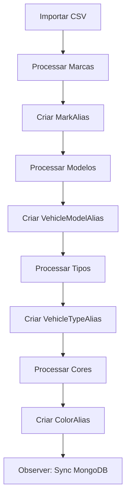
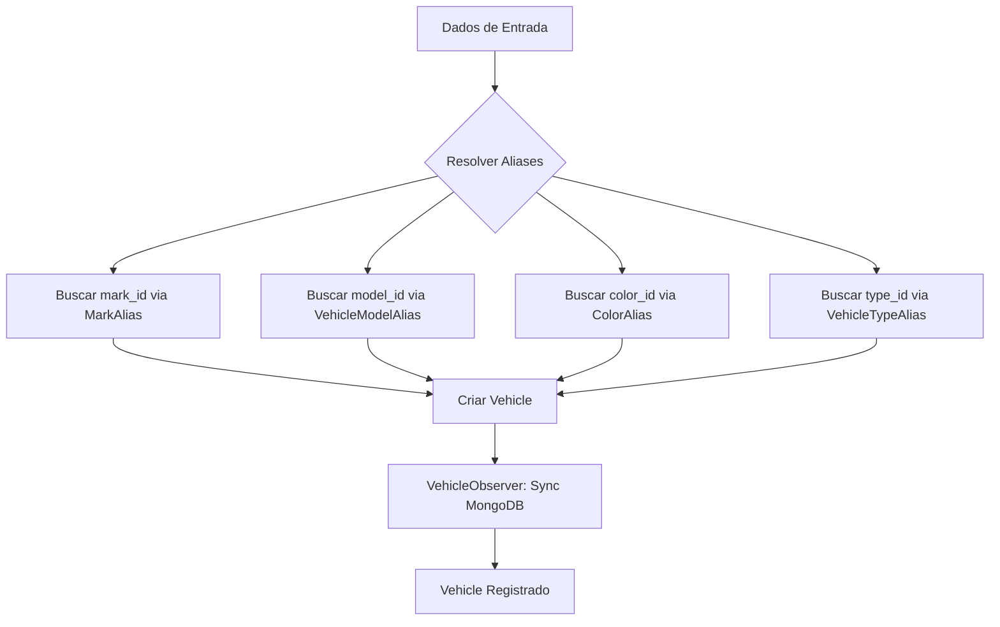
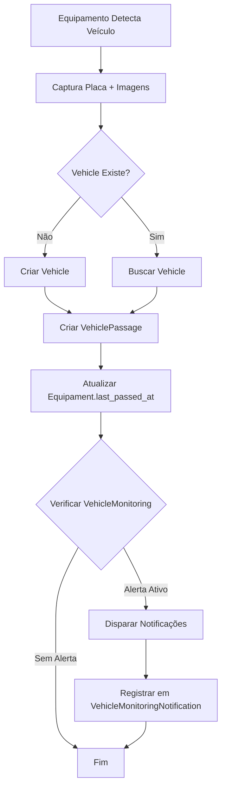
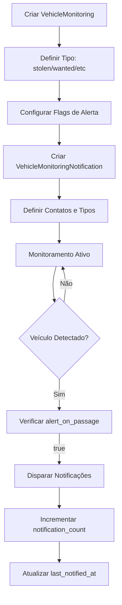

# Lógica de Uso do Módulo de Veículos

> Guia completo de funcionamento, fluxos de dados e casos de uso do sistema de gerenciamento de veículos.

**Data de Atualização**: Dezembro 2025  
**Versão**: 1.0

---

## 📋 Índice

1. [Visão Geral](#visão-geral)
2. [Arquitetura do Sistema](#arquitetura-do-sistema)
3. [Fluxos de Dados](#fluxos-de-dados)
4. [Casos de Uso Detalhados](#casos-de-uso-detalhados)
5. [Sistema de Aliases](#sistema-de-aliases)
6. [Integração MySQL/MongoDB](#integração-mysqlmongodb)
7. [Sistema de Alertas e Monitoramento](#sistema-de-alertas-e-monitoramento)
8. [Queries Comuns](#queries-comuns)
9. [Boas Práticas](#boas-práticas)

---

## 🎯 Visão Geral

O módulo de veículos é composto por **4 subsistemas integrados**:

### 1. **Catalogação** (Dados Mestres)
Armazena informações padronizadas de marcas, modelos, cores e tipos de veículos com suporte a aliases multi-idioma.

### 2. **Identificação** (Veículos)
Registra veículos individuais com placa, chassi, e referências aos dados mestres.

### 3. **Rastreamento** (Passagens)
Captura eventos de passagem de veículos detectados por equipamentos de monitoramento.

### 4. **Segurança** (Monitoramento & Whitelist)
Gerencia alertas para veículos roubados/procurados e lista branca de veículos autorizados.

---

## 🏗️ Arquitetura do Sistema

```
┌────────────────────────────────────────────────────────────┐
│                  SUBSISTEMA 1: CATALOGAÇÃO                 │
│                      (Dados Mestres)                       │
├────────────────────────────────────────────────────────────┤
│                                                            │
│  Mark                    VehicleModel                      │
│  ├─ MarkAlias            ├─ VehicleModelAlias             │
│                                                            │
│  VehicleType             Color                            │
│  ├─ VehicleTypeAlias     ├─ ColorAlias                    │
│                                                            │
└────────────────────────────────────────────────────────────┘
                         ↓ FK References
┌────────────────────────────────────────────────────────────┐
│              SUBSISTEMA 2: IDENTIFICAÇÃO                   │
├────────────────────────────────────────────────────────────┤
│                                                            │
│                       Vehicle                              │
│  • uuid (identificador global)                             │
│  • plate (placa única)                                     │
│  • chassis_number (VIN)                                    │
│  • mark_id, model_id, color_id, type_id                   │
│  • year_of_manufacture, year_model                         │
│                                                            │
└────────────────────────────────────────────────────────────┘
                         ↓
┌────────────────────────────────────────────────────────────┐
│               SUBSISTEMA 3: RASTREAMENTO                   │
├────────────────────────────────────────────────────────────┤
│                                                            │
│  Equipament  ───────→  VehiclePassage                     │
│  • location             • vehicle_id                       │
│  • latitude/longitude   • equipament_id                    │
│  • serial_number        • passed_at                        │
│  • is_active            • plate (redundante)               │
│                         • passage_images                   │
│                         • first (flag)                     │
│                                                            │
└────────────────────────────────────────────────────────────┘
                         ↓
┌────────────────────────────────────────────────────────────┐
│                SUBSISTEMA 4: SEGURANÇA                     │
├────────────────────────────────────────────────────────────┤
│                                                            │
│  VehicleMonitoring                                         │
│  ├─ VehicleMonitoringType (stolen, wanted, etc.)          │
│  └─ VehicleMonitoringNotification                          │
│                                                            │
│  VehicleWhitelist                                          │
│  └─ Lista de veículos autorizados por cliente             │
│                                                            │
└────────────────────────────────────────────────────────────┘
```

---

## 🔄 Fluxos de Dados

### Fluxo 1: Setup Inicial (Carga de Dados Mestres)



**Implementação**:
```php
// 1. Executar seeders/importers
php artisan db:seed --class=MarkSeeder
php artisan db:seed --class=VehicleModelSeeder
php artisan db:seed --class=VehicleTypeSeeder
php artisan db:seed --class=ColorSeeder

// 2. Observers sincronizam automaticamente com MongoDB
// 3. Sistema está pronto para receber veículos
```

### Fluxo 2: Registro de Veículo



**Exemplo Prático**:
```php
// Entrada: Dados variados (possivelmente com aliases)
$input = [
    'plate' => 'ABC1D23',
    'mark' => 'トヨタ',           // Alias japonês
    'model' => 'Corolla',
    'color' => 'preta',          // Alias português feminino
    'type' => 'automóvel',       // Alias português
    'year_manufacture' => 2023,
    'chassis' => '1HGBH41JXMN109186',
];

// Resolução de aliases
$mark = Mark::whereHas('markAliases', function($q) use ($input) {
    $q->where('alias', $input['mark']);
})->first();

$model = VehicleModel::whereHas('vehicleModelAliases', function($q) use ($input) {
    $q->where('alias', $input['model']);
})->first();

$color = Color::whereHas('colorAliases', function($q) use ($input) {
    $q->where('alias', $input['color']);
})->first();

$type = VehicleType::whereHas('vehicleTypeAliases', function($q) use ($input) {
    $q->where('alias', $input['type']);
})->first();

// Criação do veículo com IDs canônicos
$vehicle = Vehicle::create([
    'plate' => $input['plate'],
    'mark_id' => $mark->id,              // ID resolvido
    'model_id' => $model->id,            // ID resolvido
    'color_id' => $color->id,            // ID resolvido
    'type_id' => $type->id,              // ID resolvido
    'year_of_manufacture' => $input['year_manufacture'],
    'chassis_number' => $input['chassis'],
]);

// VehicleObserver automaticamente sincroniza com MongoDB
```

### Fluxo 3: Detecção de Passagem



**Exemplo Prático**:
```php
// Dados recebidos do equipamento
$passageData = [
    'equipament_serial' => 'EQ-SP-001',
    'plate' => 'ABC1D23',
    'timestamp' => '2025-12-24 10:30:00',
    'images' => [
        'https://storage.example.com/passage/img1.jpg',
        'https://storage.example.com/passage/img2.jpg',
    ],
    'latitude' => -23.550520,
    'longitude' => -46.633308,
];

// 1. Buscar ou criar veículo
$vehicle = Vehicle::firstOrCreate(
    ['plate' => $passageData['plate']],
    ['uuid' => Str::uuid()]
);

// 2. Buscar equipamento
$equipament = Equipament::where('serial_number', $passageData['equipament_serial'])
    ->firstOrFail();

// 3. Verificar se é primeira passagem
$isFirst = !VehiclePassage::where('vehicle_id', $vehicle->id)->exists();

// 4. Criar registro de passagem
$passage = VehiclePassage::create([
    'uuid' => Str::uuid(),
    'vehicle_id' => $vehicle->id,
    'equipament_id' => $equipament->id,
    'plate' => $passageData['plate'],        // Redundante para busca rápida
    'client_id' => $equipament->client_id,
    'passed_at' => $passageData['timestamp'],
    'first' => $isFirst,
    'passage_images' => $passageData['images'],
    'latitude' => $passageData['latitude'],
    'longitude' => $passageData['longitude'],
    'location' => $equipament->location,
]);

// 5. Atualizar último uso do equipamento
$equipament->update(['last_passed_at' => now()]);

// 6. Verificar alertas ativos
$monitoring = VehicleMonitoring::where('vehicle_id', $vehicle->id)
    ->active()
    ->shouldAlert()
    ->with('notifications.active')
    ->first();

if ($monitoring) {
    // Disparar notificações (SMS, WhatsApp, Email, Push)
    foreach ($monitoring->notifications as $notification) {
        dispatch(new SendVehicleAlertJob($notification, $passage));
        
        // Registrar envio
        $notification->recordNotification();
    }
}

// 7. Observer sincroniza com MongoDB automaticamente
```

### Fluxo 4: Sistema de Alertas



**Exemplo Prático**:
```php
// CENÁRIO: Veículo Roubado Reportado
$stolenType = VehicleMonitoringType::where('canonical_name', 'stolen')->first();

// 1. Criar monitoramento
$monitoring = VehicleMonitoring::create([
    'uuid' => Str::uuid(),
    'vehicle_id' => $vehicle->id,
    'client_id' => $client->id,
    'monitoring_type_id' => $stolenType->id,
    'plate' => $vehicle->plate,
    'owner_name' => 'João da Silva',
    'contact_phone' => '+55 11 98765-4321',
    'registered_at' => now(),
    'stolen_at' => now()->subDays(2),
    'status' => 'active',
    'alert_on_passage' => true,
    'is_global_alert' => true,      // Alertar todos os clientes
    'observation' => 'Veículo roubado na Av. Paulista',
    'custom_alert_message' => 'ATENÇÃO: Veículo com registro de roubo',
    'created_by' => auth()->id(),
]);

// 2. Configurar notificações (quem será alertado)
$monitoring->notifications()->create([
    'uuid' => Str::uuid(),
    'user_id' => $guardaUser->id,
    'contact_name' => 'Guarda Municipal - Central',
    'phone_number' => '+55 11 98888-7777',
    'email' => 'central@guardamunicipal.sp.gov.br',
    'notification_type' => 'whatsapp',
    'is_active' => true,
    'created_by' => auth()->id(),
]);

// 3. Quando veículo passar em qualquer equipamento:
// - Sistema detecta passagem
// - Verifica VehicleMonitoring.shouldAlert()
// - Dispara notificações automáticas
// - Registra histórico (notification_count, last_notified_at)
```

---

## 📚 Casos de Uso Detalhados

### Caso 1: Busca de Veículo com Alias Multi-Idioma

**Problema**: Cliente busca "Opel Corsa" mas sistema armazena "Chevrolet Corsa"

**Solução**:
```php
// Service para busca flexível
class VehicleSearchService
{
    public function searchByModelAlias(string $alias): Collection
    {
        // Buscar via alias
        return Vehicle::whereHas('model.vehicleModelAliases', function($q) use ($alias) {
            $q->where('alias', 'LIKE', "%{$alias}%");
        })
        ->with(['mark', 'model', 'color', 'type'])
        ->get()
        ->map(function($vehicle) {
            return [
                'id' => $vehicle->id,
                'plate' => $vehicle->plate,
                'display_name' => "{$vehicle->mark->display_name} {$vehicle->model->display_name}",
                'canonical_name' => "{$vehicle->mark->canonical_name} {$vehicle->model->canonical_name}",
                'color' => $vehicle->color->display_name,
                'type' => $vehicle->type->display_name,
            ];
        });
    }
}

// Uso
$results = $searchService->searchByModelAlias('Opel Corsa');
// Retorna veículos Chevrolet Corsa (porque Opel Corsa é alias)
```

### Caso 2: Relatório de Passagens por Período

**Requisito**: Listar todas as passagens de um veículo em um período

```php
class VehiclePassageReportService
{
    public function getPassagesByPeriod(string $plate, Carbon $start, Carbon $end): array
    {
        $vehicle = Vehicle::where('plate', $plate)->firstOrFail();
        
        $passages = VehiclePassage::where('vehicle_id', $vehicle->id)
            ->whereBetween('passed_at', [$start, $end])
            ->with(['equipament'])
            ->orderBy('passed_at', 'desc')
            ->get();
        
        return [
            'vehicle' => [
                'plate' => $vehicle->plate,
                'mark' => $vehicle->mark->display_name,
                'model' => $vehicle->model->display_name,
                'color' => $vehicle->color->display_name,
            ],
            'period' => [
                'start' => $start->format('d/m/Y H:i:s'),
                'end' => $end->format('d/m/Y H:i:s'),
            ],
            'total_passages' => $passages->count(),
            'passages' => $passages->map(function($p) {
                return [
                    'date' => $p->passed_at->format('d/m/Y H:i:s'),
                    'location' => $p->location,
                    'equipament' => $p->equipament->serial_number,
                    'images_count' => count($p->passage_images ?? []),
                ];
            }),
        ];
    }
}
```

### Caso 3: Veículos Mais Detectados (Top 10)

**Requisito**: Ranking de veículos por quantidade de passagens

```php
class VehicleStatisticsService
{
    public function topVehiclesByPassages(int $limit = 10, Carbon $start = null, Carbon $end = null): Collection
    {
        $query = VehiclePassage::select('vehicle_id', DB::raw('COUNT(*) as passage_count'))
            ->groupBy('vehicle_id')
            ->orderBy('passage_count', 'desc')
            ->limit($limit);
        
        if ($start && $end) {
            $query->whereBetween('passed_at', [$start, $end]);
        }
        
        $topPassages = $query->get();
        
        $vehicleIds = $topPassages->pluck('vehicle_id');
        
        $vehicles = Vehicle::whereIn('id', $vehicleIds)
            ->with(['mark', 'model', 'color', 'type'])
            ->get()
            ->keyBy('id');
        
        return $topPassages->map(function($passage) use ($vehicles) {
            $vehicle = $vehicles[$passage->vehicle_id];
            
            return [
                'rank' => null, // Será preenchido depois
                'plate' => $vehicle->plate,
                'vehicle' => "{$vehicle->mark->display_name} {$vehicle->model->display_name}",
                'color' => $vehicle->color->display_name,
                'type' => $vehicle->type->display_name,
                'passage_count' => $passage->passage_count,
            ];
        })->values()->each(function($item, $index) {
            $item['rank'] = $index + 1;
        });
    }
}
```

### Caso 4: Alerta Automático para Veículo com Placa Clonada

**Cenário**: Sistema detecta duas passagens simultâneas em locais distantes

```php
class ClonedPlateDetectionService
{
    public function detectClonedPlate(VehiclePassage $newPassage): ?VehicleMonitoring
    {
        // Buscar última passagem do veículo
        $lastPassage = VehiclePassage::where('vehicle_id', $newPassage->vehicle_id)
            ->where('id', '!=', $newPassage->id)
            ->orderBy('passed_at', 'desc')
            ->first();
        
        if (!$lastPassage) {
            return null;
        }
        
        // Calcular diferença de tempo
        $timeDiff = $newPassage->passed_at->diffInMinutes($lastPassage->passed_at);
        
        // Calcular distância entre locais (em km)
        $distance = $this->calculateDistance(
            $lastPassage->latitude, $lastPassage->longitude,
            $newPassage->latitude, $newPassage->longitude
        );
        
        // Velocidade necessária (km/h)
        $requiredSpeed = ($distance / $timeDiff) * 60;
        
        // Se velocidade necessária > 200 km/h, possível placa clonada
        if ($requiredSpeed > 200) {
            $clonedType = VehicleMonitoringType::where('canonical_name', 'cloned_plate')->first();
            
            // Criar alerta automático
            $monitoring = VehicleMonitoring::create([
                'uuid' => Str::uuid(),
                'vehicle_id' => $newPassage->vehicle_id,
                'client_id' => $newPassage->client_id,
                'monitoring_type_id' => $clonedType->id,
                'plate' => $newPassage->plate,
                'status' => 'active',
                'alert_on_passage' => true,
                'match_probability' => 85.50, // % de certeza
                'observation' => "Suspeita de placa clonada. Distância: {$distance}km em {$timeDiff}min (velocidade necessária: {$requiredSpeed}km/h)",
                'created_by' => null, // Sistema automático
            ]);
            
            // Notificar autoridades
            $this->notifyAuthorities($monitoring, $newPassage, $lastPassage);
            
            return $monitoring;
        }
        
        return null;
    }
    
    private function calculateDistance($lat1, $lon1, $lat2, $lon2): float
    {
        // Fórmula de Haversine
        $earthRadius = 6371; // km
        
        $dLat = deg2rad($lat2 - $lat1);
        $dLon = deg2rad($lon2 - $lon1);
        
        $a = sin($dLat/2) * sin($dLat/2) +
             cos(deg2rad($lat1)) * cos(deg2rad($lat2)) *
             sin($dLon/2) * sin($dLon/2);
        
        $c = 2 * atan2(sqrt($a), sqrt(1-$a));
        
        return $earthRadius * $c;
    }
}
```

---

## 🔤 Sistema de Aliases

### Conceito

O sistema de aliases permite buscas flexíveis, suportando:
- Variações linguísticas (português, inglês, japonês, etc.)
- Variações regionais (Opel Corsa, Vauxhall Corsa, Chevrolet Corsa)
- Nomes coloquiais ("Uno", "Fusca", "Gol")

### Normalização

**Padrão de Armazenamento**:
- `canonical_name`: Nome canônico normalizado (lowercase, sem acentos)
- `display_name`: Nome amigável para exibição
- `alias`: Variações do nome (incluindo canonical e display)

**Exemplo**:
```
Mark {
    canonical_name: "toyota_motor"
    display_name: "Toyota"
}

MarkAlias {
    alias: "toyota"
    alias: "トヨタ"
    alias: "toyotta" (erro comum)
}
```

### Buscas com Aliases

```php
// Buscar marca por qualquer alias
$mark = Mark::whereHas('markAliases', function($q) {
    $q->where('alias', 'トヨタ');
})->first();

// Resultado: Mark com canonical_name = "toyota_motor"
```

### Service Helper

```php
class AliasResolverService
{
    public function resolveMarkId(string $alias): ?int
    {
        return Mark::whereHas('markAliases', function($q) use ($alias) {
            $q->where('alias', $alias);
        })->value('id');
    }
    
    public function resolveModelId(string $alias): ?int
    {
        return VehicleModel::whereHas('vehicleModelAliases', function($q) use ($alias) {
            $q->where('alias', $alias);
        })->value('id');
    }
    
    public function resolveColorId(string $alias): ?int
    {
        return Color::whereHas('colorAliases', function($q) use ($alias) {
            $q->where('alias', $alias);
        })->value('id');
    }
    
    public function resolveTypeId(string $alias): ?int
    {
        return VehicleType::whereHas('vehicleTypeAliases', function($q) use ($alias) {
            $q->where('alias', $alias);
        })->value('id');
    }
}
```

---

## 🔄 Integração MySQL/MongoDB

### Estratégia de Sincronização

**MySQL**: Dados transacionais, integridade referencial, queries relacionais
**MongoDB**: Buscas rápidas, agregações, dados desnormalizados

### Observers Automáticos

Todos os modelos principais possuem Observers que sincronizam automaticamente:

```php
// app/Observers/Vehicles/VehicleObserver.php
class VehicleObserver
{
    public function created(Vehicle $vehicle): void
    {
        DB::connection('mongodb')
            ->collection('vehicles')
            ->insert($this->prepareMongoData($vehicle));
    }
    
    public function updated(Vehicle $vehicle): void
    {
        DB::connection('mongodb')
            ->collection('vehicles')
            ->where('uuid', $vehicle->uuid)
            ->update($this->prepareMongoData($vehicle));
    }
    
    public function deleted(Vehicle $vehicle): void
    {
        // Soft delete
        DB::connection('mongodb')
            ->collection('vehicles')
            ->where('uuid', $vehicle->uuid)
            ->update(['deleted_at' => now()]);
    }
    
    private function prepareMongoData(Vehicle $vehicle): array
    {
        $vehicle->load(['mark', 'model', 'color', 'type']);
        
        return [
            'uuid' => $vehicle->uuid,
            'plate' => $vehicle->plate,
            'chassis_number' => $vehicle->chassis_number,
            'mark' => [
                'id' => $vehicle->mark->id,
                'canonical_name' => $vehicle->mark->canonical_name,
                'display_name' => $vehicle->mark->display_name,
            ],
            'model' => [
                'id' => $vehicle->model->id,
                'canonical_name' => $vehicle->model->canonical_name,
                'display_name' => $vehicle->model->display_name,
            ],
            'color' => [
                'id' => $vehicle->color->id,
                'canonical_name' => $vehicle->color->canonical_name,
                'display_name' => $vehicle->color->display_name,
            ],
            'type' => [
                'id' => $vehicle->type->id,
                'canonical_name' => $vehicle->type->canonical_name,
                'display_name' => $vehicle->type->display_name,
            ],
            'year_of_manufacture' => $vehicle->year_of_manufacture,
            'year_model' => $vehicle->year_model,
            'created_at' => $vehicle->created_at,
            'updated_at' => $vehicle->updated_at,
        ];
    }
}
```

### Quando Usar Cada Banco

**Use MySQL quando**:
- Precisar de transações ACID
- Relacionamentos complexos (JOINs)
- Integridade referencial é crítica
- Consultas analíticas com agregações

**Use MongoDB quando**:
- Buscas por texto livre
- Dados desnormalizados (evitar JOINs)
- Análises de big data
- Necessita flexibilidade de schema

---

## 🚨 Sistema de Alertas e Monitoramento

### Tipos de Monitoramento (Seeded)

```php
VehicleMonitoringType {
    1. stolen           → Veículo Roubado/Furtado    (critical)
    2. wanted           → Veículo Procurado          (high)
    3. suspicious       → Veículo Suspeito           (medium)
    4. cloned_plate     → Placa Clonada              (high)
    5. restricted_area  → Restrição de Área          (medium)
    6. custom           → Monitoramento Personalizado (low)
}
```

### Flags de Controle

```php
VehicleMonitoring {
    status: ['active', 'inactive', 'recovered', 'expired']
    alert_on_passage: bool     // Disparar alerta ao detectar passagem
    is_verified: bool          // Informação verificada por autoridade
    is_recovered: bool         // Veículo foi recuperado
    is_private: bool           // Monitoramento privado (não compartilhar)
    is_global_alert: bool      // Alertar todos os clientes/equipamentos
}
```

### Scopes de Busca

```php
// Veículos com alerta ativo
$monitored = VehicleMonitoring::active()->get();

// Veículos que devem disparar alerta
$shouldAlert = VehicleMonitoring::shouldAlert()->get();

// Por cliente
$clientMonitoring = VehicleMonitoring::forClient($clientId)->get();

// Por placa
$byPlate = VehicleMonitoring::byPlate('ABC1D23')->get();
```

### Helper Methods

```php
// Verificar se monitoramento está válido
if ($monitoring->isValid()) {
    // Ainda ativo e dentro do prazo
}

// Marcar como recuperado
$monitoring->markAsRecovered();

// Verificar se expirou
if ($monitoring->hasExpired()) {
    $monitoring->expire();
}
```

---

## 📊 Queries Comuns

### 1. Buscar Veículo Completo

```php
$vehicle = Vehicle::with([
    'mark.markAliases',
    'model.vehicleModelAliases',
    'color.colorAliases',
    'type.vehicleTypeAliases',
    'vehiclePassages' => function($q) {
        $q->orderBy('passed_at', 'desc')->limit(10);
    },
    'vehiclePassages.equipament',
])
->where('plate', 'ABC1D23')
->firstOrFail();
```

### 2. Passagens de Hoje por Equipamento

```php
$todayPassages = VehiclePassage::whereDate('passed_at', today())
    ->where('equipament_id', $equipamentId)
    ->with(['vehicle.mark', 'vehicle.model'])
    ->orderBy('passed_at', 'desc')
    ->paginate(50);
```

### 3. Veículos Monitorados Ativos

```php
$monitoredVehicles = VehicleMonitoring::with([
    'vehicle.mark',
    'vehicle.model',
    'monitoringType',
    'client',
    'notifications' => function($q) {
        $q->where('is_active', true);
    },
])
->active()
->shouldAlert()
->get();
```

### 4. Histórico de Notificações de um Veículo

```php
$notifications = VehicleMonitoringNotification::whereHas('vehicleMonitoring', function($q) use ($vehicleId) {
    $q->where('vehicle_id', $vehicleId);
})
->with(['vehicleMonitoring.monitoringType'])
->orderBy('last_notified_at', 'desc')
->get();
```

### 5. Veículos na Whitelist de um Cliente

```php
$whitelisted = VehicleWhitelist::where('client_id', $clientId)
    ->where('status', 'active')
    ->where(function($q) {
        $q->whereNull('monitor_until')
          ->orWhere('monitor_until', '>', now());
    })
    ->with('vehicle')
    ->get();
```

---

## ✅ Boas Práticas

### 1. Sempre Use Eager Loading

❌ **Ruim** (N+1 Problem):
```php
$vehicles = Vehicle::all();
foreach ($vehicles as $vehicle) {
    echo $vehicle->mark->display_name; // Query para cada veículo
}
```

✅ **Bom**:
```php
$vehicles = Vehicle::with('mark')->get();
foreach ($vehicles as $vehicle) {
    echo $vehicle->mark->display_name; // Sem queries extras
}
```

### 2. Use Aliases para Buscas Flexíveis

❌ **Ruim**:
```php
$vehicle = Vehicle::whereHas('mark', function($q) {
    $q->where('canonical_name', 'toyota');
})->first();
```

✅ **Bom**:
```php
$vehicle = Vehicle::whereHas('mark.markAliases', function($q) {
    $q->where('alias', 'トヨタ'); // Aceita qualquer alias
})->first();
```

### 3. Sempre Valide Dados de Entrada

```php
// Form Request
class StoreVehicleRequest extends FormRequest
{
    public function rules(): array
    {
        return [
            'plate' => 'required|string|max:10|unique:vehicles,plate',
            'mark_id' => 'required|exists:marks,id',
            'model_id' => 'required|exists:vehicle_models,id',
            'color_id' => 'required|exists:colors,id',
            'type_id' => 'required|exists:vehicle_types,id',
            'year_of_manufacture' => 'required|integer|min:1900|max:' . date('Y'),
            'chassis_number' => 'nullable|string|size:17|unique:vehicles,chassis_number',
        ];
    }
}
```

### 4. Use Scopes para Queries Complexas

```php
// Model
class VehicleMonitoring extends Model
{
    public function scopeActive($query)
    {
        return $query->where('status', 'active')
            ->where(function ($q) {
                $q->whereNull('valid_until')
                  ->orWhere('valid_until', '>', now());
            });
    }
    
    public function scopeShouldAlert($query)
    {
        return $query->active()->where('alert_on_passage', true);
    }
}

// Usage
$monitored = VehicleMonitoring::shouldAlert()->get();
```

### 5. Documente Relacionamentos nos Models

```php
/**
 * Get the vehicle being monitored.
 *
 * @return \Illuminate\Database\Eloquent\Relations\BelongsTo
 */
public function vehicle(): BelongsTo
{
    return $this->belongsTo(Vehicle::class);
}
```

### 6. Use Transações para Operações Críticas

```php
DB::transaction(function () use ($data) {
    $vehicle = Vehicle::create($data['vehicle']);
    
    $monitoring = VehicleMonitoring::create([
        'vehicle_id' => $vehicle->id,
        ...$data['monitoring']
    ]);
    
    foreach ($data['notifications'] as $notification) {
        $monitoring->notifications()->create($notification);
    }
});
```

### 7. Implemente Try-Catch em Observers

```php
public function created(Vehicle $vehicle): void
{
    try {
        DB::connection('mongodb')
            ->collection('vehicles')
            ->insert($this->prepareMongoData($vehicle));
            
        Log::info('Vehicle synced to MongoDB', ['vehicle_id' => $vehicle->id]);
    } catch (\Exception $e) {
        Log::error('Failed to sync vehicle to MongoDB', [
            'vehicle_id' => $vehicle->id,
            'error' => $e->getMessage(),
        ]);
        
        // Não falhar a operação MySQL por falha no MongoDB
    }
}
```

---

## 📖 Referências

- [Estrutura do Banco de Dados - Veículos](vehicles-structure.md)
- [Documentação de Tabelas](vehicle-tables.md)
- [Arquitetura de Localizações](locations-architecture.md)
- [MongoDB Query Service](MongoDBQueryService.md)

---

**Última Atualização**: 24/12/2025  
**Autor**: CCONet Team
